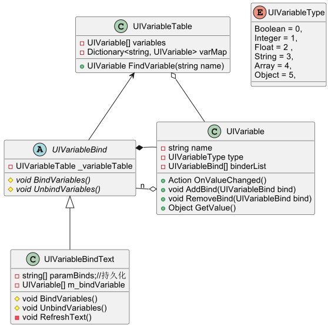
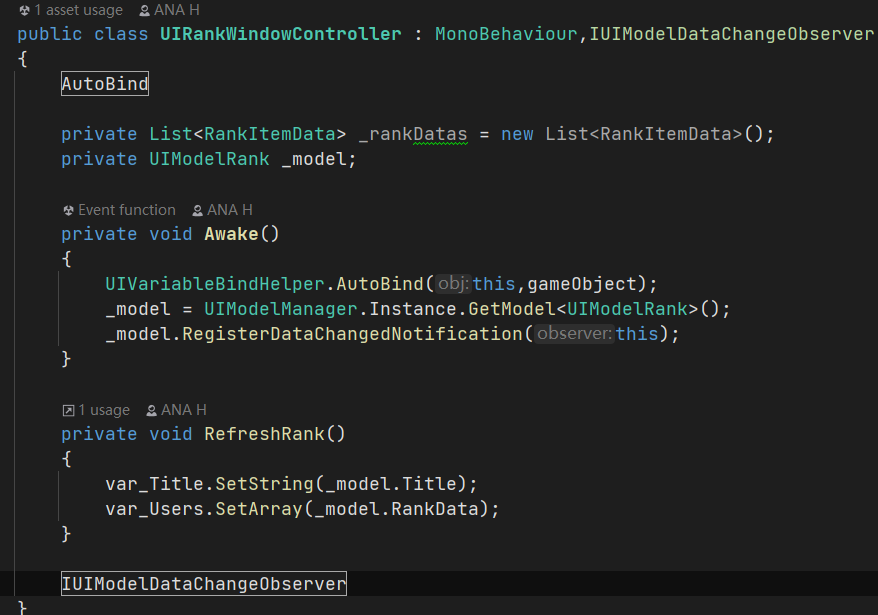

# ReactUIForUnity

## 框架结构和简介
UI框架结构如下

基本结构是MVP,使用ReactUI改造了p到v的部分.

对团队开发非常友好,当VariableTable定下后,Model、Controller和View部分可分开同时进行开发;

并且在对View部分的逻辑用ReactUI封装后,View的开发可完全交由策划和UI同学进行;

UI较小的频繁迭代可完全不动代码;

熟练后此框架团队开发效率非常高.

## ReactUI部分

UIVariableTable持有构建UI所需的UIVariable,一般可在Controller中维护其数据的更新;

UIVariableTable数据变动时会触发对应的UIVariableBind,以改变UI状态;

UIVariableBind支持随意扩展,除一般功能外也可支持非常特殊的自定义功能;

以下为部分UIVariableBind扩展(分别是BindActive,BindText,BindImage)的演示;

做了一些Editor模式的支持,可直接改变UIVariableTable,从而看到UI的变化效果

## 例子
打开SimpleScene,可看到一个简单的例子;

此为例子的Controller部分代码,AutoBind部分为自动生成的代码(可点击UIVariableTable的生成代码按钮,生成到剪贴板);

IUIModelDataChangeObserver部分为一个简易的观察者模式接口(定义model数据变动后Controller的响应);

Awake(可根据游戏框架选择合适的时机,此处偷懒在awake中进行)中对ReactUI进行了绑定,并对model注册了观察者;

RefreshRank中为UIVariableTable更新数据.